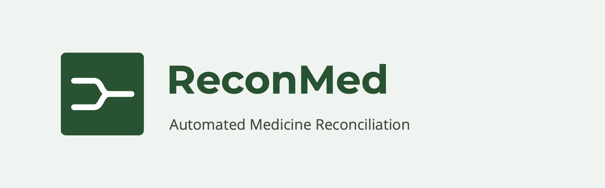

<a id="readme-top"></a>

[![MIT License][license-shield]][license-url]
[![Contributors][contributors-shield]][contributors-url]

# Telephony



> Placing a call, with two interchangeable providers behind one interface.

Part of **[ReconMed](../../README.md)** — pre-visit concomitant medication
reconciliation for clinical trial sites. This is how the agent reaches the
participant.

| provider | what it does | cost |
|---|---|---|
| `simulated` (default) | rings the voice web app — the "phone" is a browser, typically on the ngrok URL | none |
| `twilio` | places a real call over the telephone network | real money |

Everything after someone says hello is identical in both. The simulated
provider is not a stub standing in for the interesting part; the interesting
part is the conversation, and that is the same code either way.

## How a call flows

```
dashboard                voice server                  handset
   │  POST /api/calls        │                            │
   ├────────────────────────►│                            │
   │                         │  provider.placeCall()      │
   │                         │  ─ simulated: SSE ────────►│  ringtone + answer screen
   │  { call, status }       │                            │
   │◄────────────────────────┤                            │
   │                         │◄─ POST /api/calls/:id/answer
   │                         │                            │  runs the normal call flow:
   │                         │                            │  agent opens, staging, bridge
```

The handset subscribes to `GET /api/calls/stream` (server-sent events) as soon
as the page loads, so it can be rung at any time.

## The fictitious-number guard

`placeCall` refuses any number outside **555-0100 to 555-0199**, the range NANP
reserves as permanently unassignable. Override with
`TELEPHONY_ALLOW_REAL_NUMBERS=true`, and only deliberately.

This is not belt-and-braces. Switching provider is one environment variable, so
a wrong number in a seed script is one variable away from ringing a stranger at
their real telephone. The guard lives in the telephony layer rather than the
seeder because it has to hold for every caller, including future ones.

## Running a real call

Not done for the demo — it costs money — but the path is written:

1. `TELEPHONY_PROVIDER=twilio`, plus `TWILIO_ACCOUNT_SID`, `TWILIO_AUTH_TOKEN`,
   `TELEPHONY_FROM` (a number you own) and `PUBLIC_HOST` (a tunnel).
2. `providers/twilio.js` POSTs to Twilio with a TwiML URL.
3. Twilio fetches it and gets `<Connect><Stream>` pointing at
   `wss://<PUBLIC_HOST>/ws/twilio`.

**The one piece not written** is the `/ws/twilio` socket handler. Twilio streams
8 kHz mu-law; the browser path sends 16-bit PCM, so it needs a codec shim in
both directions. It is left explicitly undone rather than guessed at, because
untested audio transcoding would look finished without being finished.

## Known issues

- `/ws/twilio` (mu-law ↔ PCM codec) is the only missing piece for real calls.
- A `twilio` run costs real money and rings a real telephone; keep
  `TELEPHONY_ALLOW_REAL_NUMBERS` unset unless you mean it.

## License

Distributed under the MIT License. See [`../../LICENSE`](../../LICENSE).

## Contributors

Built at **HackMIT 2026** for the **Regeneron** track.

- **Samuel Orellana Mateo** — [@Samuel-O-M](https://github.com/Samuel-O-M)
- **Ayushi Mehrotra** — [@ayushimehrotra](https://github.com/ayushimehrotra)
- **Avighna Chhatrapati** — [@avighnac](https://github.com/avighnac)

<p align="right">(<a href="#readme-top">back to top</a>)</p>

[license-shield]: https://img.shields.io/github/license/Samuel-O-M/HackMIT-2026.svg?style=for-the-badge
[license-url]: ../../LICENSE
[contributors-shield]: https://img.shields.io/github/contributors/Samuel-O-M/HackMIT-2026.svg?style=for-the-badge
[contributors-url]: https://github.com/Samuel-O-M/HackMIT-2026/graphs/contributors
